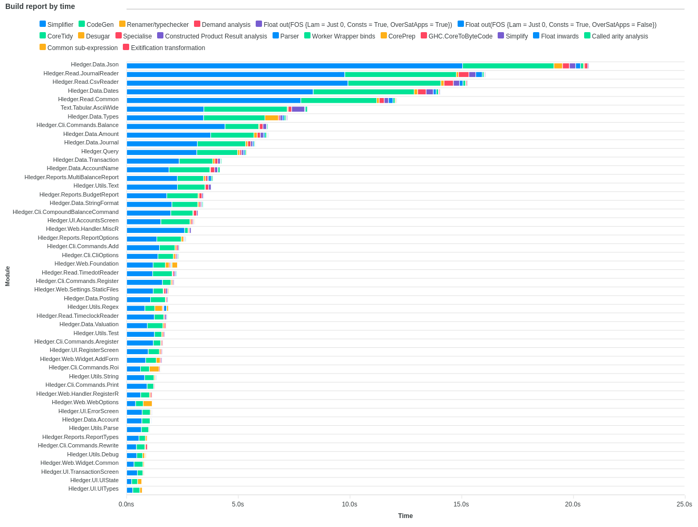

# time-ghc-modules

Figure out why your builds are slow. This tool analyzes how long it takes GHC to compile your Haskell modules, broken down by phase.

# Quick start

``` shell
cd <my-project>

stack clean
stack build --ghc-options "-ddump-to-file -ddump-timings"
# ----- OR -----
cabal clean
cabal build all --ghc-options "-ddump-to-file -ddump-timings"
```

If you have Nix, you can simply run `time-ghc-modules` from Nixpkgs!

``` shell
nix run nixpkgs#time-ghc-modules
```

Or, clone the repo first:

``` shell
git clone git@github.com:codedownio/time-ghc-modules.git /path/to/time-ghc-modules

# If you have Nix, you can use the fully reproducible version
/path/to/time-ghc-modules/time-ghc-modules-nix

# Otherwise, your system needs to have SQLite >= 3.33.0, Python 3, and sed
/path/to/time-ghc-modules/time-ghc-modules
```

The script will search for all your `*.dump-timings` files and analyze them. It will finish by printing out the path to an HTML file:

``` shell
...
--> Wrote report at file:///tmp/tmp.pvnp4FYmLa/report.html
```

# Example: hledger

You can generate the time report below for [hledger](https://github.com/simonmichael/hledger) by running the following commands (assuming you have Nix).

``` shell
set -e
cd $(mktemp -d)
git clone git@github.com:simonmichael/hledger.git
git clone git@github.com:codedownio/time-ghc-modules.git
cd hledger
stack build --ghc-options "-ddump-to-file -ddump-timings"
../time-ghc-modules/time-ghc-modules-nix
```



# Tips

* The script will output its log messages to `stderr` and print the final report path to `stdout` (assuming it didn't exit with a failure). This makes it easy to use the output in scripts. For example:

``` shell
# Build the report and open it in your browser
> firefox $(/path/to/time-ghc-modules/time-ghc-modules)
```

``` shell
# Build the report in CI and stash it somewhere
> cp $(/path/to/time-ghc-modules/time-ghc-modules) $MY_CI_ARTIFACTS_DIR/
```

* You can also look at the timing of individual components, but doing e.g. `stack build some-component:lib`. But, make sure to clean up any old `.dump-timings` files from previous runs:

``` shell
find . -name "*.dump-timings" | xargs rm
```

* GHC's `-dumpdir` option can be used to consolidate the `.dump-timings` files, so they aren't left all over your source tree. For example:

``` shell
stack build --ghc-options "-ddump-to-file -ddump-timings -dumpdir .ghcdump"
```

# Compatibility

The flag `-ddump-timings` is available for `GHC >= 8.4.1`.
